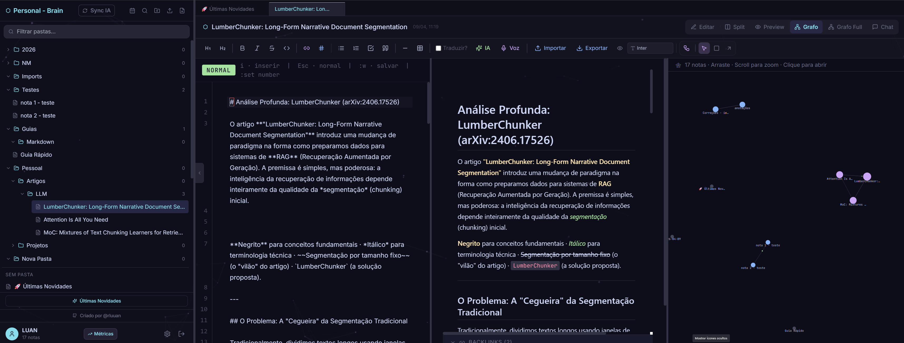

<p align="center">
  
</p>

<h1 align="center">Personal Brain</h1>

<p align="center">
  Sistema de anotações pessoal com IA local, editor Vim, RAG, diagramas e criptografia E2E.
</p>

<p align="center">
  
  
  
  
  
</p>

---

> **Primeira release open-source!** Feedbacks, issues e PRs são muito bem-vindos. Bora evoluir isso juntos.

---

## Screenshot



---

## O que é

Personal Brain é uma aplicação desktop (Electron) + web para gestão de conhecimento pessoal. Inspirado na visão de **Andrej Karpathy** sobre usar LLMs como orquestradores de bases de conhecimento: suas notas não ficam apenas armazenadas, elas se tornam uma memória pesquisável e interligada.

**Tudo roda localmente.** Seus dados nunca saem do seu dispositivo.

---

## Funcionalidades

| | |
|---|---|
| 📝 **Editor Markdown** | Auto-save, preview em tempo real, Split/Preview/Edit |
| ⌨️ **Modo Vim** | CodeMirror 6 + vim keybindings completos (NORMAL/INSERT/VISUAL/REPLACE, `:w`, `:set number`, etc.) |
| 🔗 **Wiki-links** | `[[Nome da Nota]]` com autocomplete e navegação por clique |
| 🕸️ **Grafo interativo** | Canvas force-directed com todos os backlinks |
| 💬 **Chat com RAG** | Pergunta sobre suas notas — a IA busca os trechos relevantes e responde com contexto real |
| 🪄 **Formatação por IA** | Cole um texto bruto, a IA formata em Markdown automaticamente (seleção ou nota inteira) |
| 📊 **Diagramas inline** | Blocos ` ```diagram ``` ` renderizados em canvas customizado |
| 🗓️ **Nota Diária** | Cria/abre a nota do dia automaticamente em `ano > mês > dia` |
| 🗂️ **Abas** | Notas em abas persistentes, fecháveis com Ctrl+W |
| 🔒 **Criptografia E2E** | AES-256/PBKDF2 no cliente — servidor só armazena ciphertext |
| 🔍 **Busca global** | Ctrl+K para busca instantânea |
| 🎙️ **Transcrição por voz** | Microfone → texto direto no editor (requer HTTPS ou localhost) |

---

## Stack

- **Frontend:** React 18, Zustand, CodeMirror 6, Tailwind CSS
- **Backend:** Node.js, Express
- **Banco de dados:** SQLite (padrão, zero config) · PostgreSQL com pgvector (opcional, para RAG avançado)
- **IA:** [Ollama](https://ollama.com/) local — modelos configuráveis nas Settings

---

## Instalação para desenvolvimento

### Pré-requisitos

- [Node.js](https://nodejs.org/) v18+
- [Ollama](https://ollama.com/) (opcional — só para funcionalidades de IA)

### Passos

```bash
# 1. Clone o repositório
git clone https://github.com/rluuan/personal-brain-public.git
cd personal-brain-public

# 2. Instale as dependências
npm install

# 3. Inicie o servidor da API (porta 3001)
npm run server

# 4. Em outro terminal, inicie o frontend (porta 5173)
npm run dev
```

Acesse `http://localhost:5173`.

### Configurar modelos de IA (opcional)

```bash
ollama pull gemma3:12b        # LLM para formatação e chat
ollama pull nomic-embed-text  # Embeddings para RAG
```

Os modelos são configuráveis em **Settings → IA**.

---

## Download

Baixe o instalador direto em: **[github.com/rluuan/personal-brain-public/releases](https://github.com/rluuan/personal-brain-public/releases)**

| Arquivo | Descrição |
|---|---|
| `Personal Brain Setup x.x.x.exe` | Instalador recomendado. Instala sem precisar de administrador. Recebe atualizações automáticas. |
| `Personal Brain Portable x.x.x.exe` | Roda sem instalar. Os dados ficam na máquina — não viajam com o `.exe`. |

> **Requisitos:** Windows 10/11 x64 · [Ollama](https://ollama.com/) opcional (só para funcionalidades de IA)

---

## Gerar o instalador desktop (.exe)

O app pode ser empacotado como instalador Windows via Electron.

### 1. Instalar dependências do Electron

```bash
npm install
```

### 2. Recompilar módulos nativos para o Electron

O SQLite (`better-sqlite3`) é um módulo nativo e precisa ser recompilado para a versão do Node embutida no Electron:

```bash
npm run electron:rebuild
```

### 3. Gerar o instalador

```bash
npm run electron:build
```

O instalador será gerado em `dist/Personal Brain Setup x.x.x.exe`.


---

## Licença

[AGPL-3.0-or-later](LICENSE)
